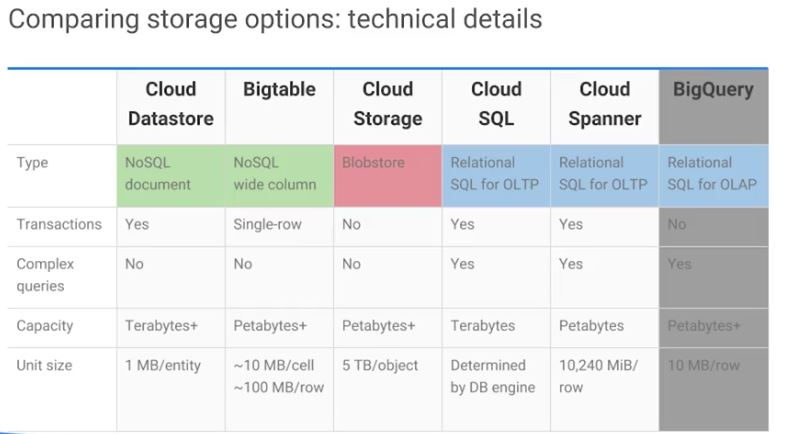

1. Consider using Cloud Datastore if you need to store unstructured objects or if you require support for transactions and SQ like queries. This storage services provides terabytes of capacity with a maximum unit size of one megabyte per entity. 

2. Consider using Cloud Bigtable if you need to store a large amount of structured objects. Cloud Bigtable does not support SQL's queries nor does it support multi-row transactions. This storage service provides petabytes of capacity with a maximum unit size of 10 megabytes per cell and 100 megabytes per row. 

3. Consider using Cloud Storage if you need to store immutable blobs larger than 10 megabytes such as large images or movies. This storage service provides petabytes of capacity with a maximum unit size of five terabytes per object. 

4. Consider using Cloud SQL or Cloud Spanner if you need full SQL support for an online transaction processing system. Cloud SQL provides terabytes of capacity, while Cloud Spanner provides petabytes. If Cloud SQL does not fit your requirements because you need horizontal scalability not just through the replicas, consider using Cloud Spanner.

5. We didn't cover BigQuery in this module as it sits on the edge between data storage and data processing, but you will learn more about it in the Big Data and Machine Learning in the Cloud Module.
 - The usual reason to store data in BigQuery is to use its big data analysis and interactive query and capabilities. 
 - You would not want to use BigQuery for example as the backings store for an online application. 

 ----
 Considering the technical differentiators of the different storage services, help some people decide which storage service to choose. Others like to consider **use cases**. 

* Cloud Datastore is the best for semi-structured application data that is used in app engines applications. 

* Bigtable is best for analytical data with heavy read write events like AdTech, Financial or IoT data. 

* Cloud Storage is best for structured and unstructured, binary or object data like images, large media files and backups.

* SQL is best for web frameworks and in existing applications like storing user credentials and customer orders. 

* Cloud Spanner is best for large scale database applications that are larger than two terabytes, for example, for financial trading and e-commerce use cases. 

----
## Conclusion
As I mentioned at the beginning of the module, depending on your application, you might use one or several of these services to get the job done. 