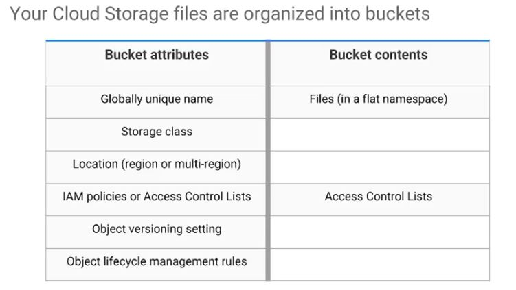

# Cloud Storage

----
## Object storage
* not the same as **file storage**, in which you manage your data as a hierarchy of folders
* not the same as **block storage**, in which your operating system manages your data as chunks of disk
* it means you save to your storage here, you keep this arbitrary bunch of bytes I give you, and the storage lets you address it with a unique **key**.
 - Often these **unique** keys are in the form of URLs, which means object storage interacts nicely with Web technologies.

 ----
 !!!!! Cloud Storage works just like that, except better !!!!!

## Cloud Storage is binary large-object storage
* High performance, internet-scale
* Simple administration
 - Does not require capacity management

> Cloud Storage is a fully managed scalable service so you do not need to provision capacity ahead of time
* Just make objects and the service stores them with high durability and high availability

## You can use Cloud Storage for lots of things
* Serving website content
* Storing data for archival and disaster recovery
* Distributing large data objects to your end users via **Direct Download**.

**Cloud Storage is not a file system** because each of your objects in Cloud Storage has an URL.

So you would not use Cloud Storage as the root file system of your Linux box

Instead, Cloud Storage is comprised of buckets.
* you create and configure and use to hold your storage objects.

----
The storage objects are immutable, which means that you do not edit them in place, but instead you **create new versions**.

## Cloud Storage is binary large-object storage
* Data encryption at rest
* Data encryption in transit by default from Google to endpoint

> Cloud Storage always encrypt your data on the server sife before it is written to disk and you don't pay extra for that.

> Also by default, data in-trainsit is encrypted using **HTTPS**.

----
When you create a bucket, you give it a globally unique name.
* You specify a geographic location where the bucket and its contents are stored
 - Pick a location that minimizes latency for you users. For example, if most of your users are in Europe, you probably want to pick a European location.
* You choose a default storage class

Quiz question: Your Cloud Storage objects live in buckets. Which of these characteristics do you define on a per-bucket basis? Choose all that are correct (3 correct answers).

1. A default storage class

2. A geographic location

3. A globally-unique name

----

Speaking of your users, there are several ways to control access to your objects and buckets. For most purposes, **Cloud IAM** is sufficient.

Roles are inherited from project to bucket to object.

If you need **finer** control, you can create **access control lists ACLs**. 

### ACL
consisits of two information
* **scope** - defines who can perform the specified actions.
* **permission** - defines what actions can be performed. (For example, read or write)

----
Remember Cloud Storage objects are immutable.

You can turn on **object versioning** on your buckets if you want. 

If you do, 
* Cloud Storage keeps a history of modifications - It overrides or deletes all of the objects in the bucket.
* You can list the archived versions of an object, restore an object to an older state or permanently delete a version as needed.

If you don't do,
* new always overrides old.

----
## What if versioning sounds good to you but you're worried about junk accumulating?

Answer:

Cloud Storage also offers **life-cycle management policies**.

> For example, you could tell Cloud Storage to delete objects older than 365 days.

> Or you could tell it to delete objects created before January 1, 2013 or keep only the three most recent versions of each object in a bucket that has versioning enabled. 