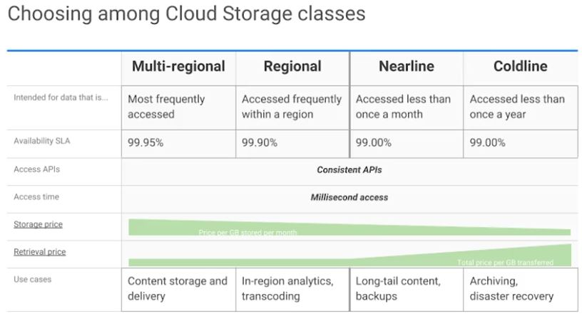
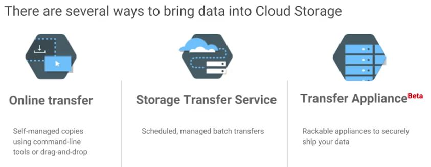
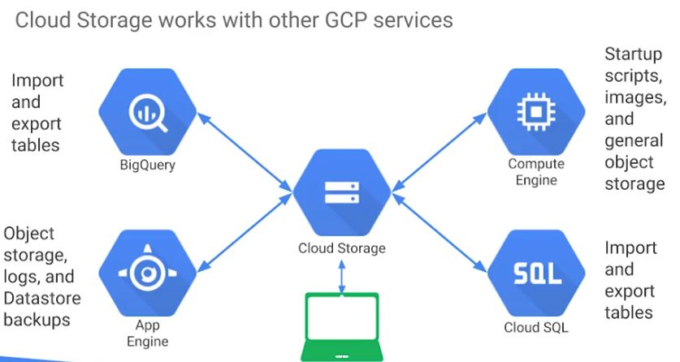

* **Multi-regional** and **regional** are high performance object storage, *whereas* **nearline** and **coldline** are backup and archival storage 

## Difference
----
### Regional storage
* Lets you store your data in a specific GCP region - US Central one, Europe West one or Asia East one
* It's **cheaper** than multi-regional storage but it offers **less redundancy**

### Multi-regional
* It costs a bit more but it is **geo-redundant** - You pick a broad geographical location like the United States, the European Union, or Asia. And Cloud Storage stores your data in at least two geographic locations separated by at least **160 kilometers**.

----
### Multi-regional storage
* is appropriate for storing **frequently accessed data**
 - Such as, website content, interactive workloads, or data that is part of mobile and gaining applications

### Regional storage
* People use ~ to store data close to their compute enginer, virtual machines, or their Kubernetes engine clusters.
 - This gives better performance for data intensice computations

----
## Nearline storage
* a low cost, highly durable service for storing **infrequently accessed data**

Question: In scenarios where you plan to read or modify your data once a month or less on average, which one is a better choise?  
Answer: **Nearline storage** better than multi-regional storage or regional storage

For example, if you want to continuously add files to cloud storage and plan to access those files once a month for analysis, nearline storage is a great choice. 

----
## Coldline storage
* a very low cost, highly durable service for data archiving, online backup, and disaster recovery
* the best choice for data that you plan to access at most once a year. Why?
 - slightly lower availability
 - 90-day minimum storage duration
 - costs for data access
 - higher per operation costs

For example, if you want to archive data or have access to it in case of a disaster recovery event.

----
## Pricing
**All storage classes** incur a cost per gigabyte of data stored per month, with multi regional having the highest storage price and coldline the lowest storage price.

Egress and data transfer charges may also apply.

###In addition to those charges, 
* **nearline storage** also incurs an access fee per gigabyte of data read
* **coldline storage** incurs a higher fee per gigabyte of data read

----

## Online transfer
* Many customers simply use **GSutil** which is the cloud storage command from this cloud SDK. 
* You can also move data in with a drag and drop in the GCP console, if you use the Google Chrome browser. 

## Storage Transfer Service
Questions: What if you have to upload **terabytes or even petabytes** of data?
* GCP offers the **online storage transfer service** and the **offline transfer appliance** to help. 
* The storage transfer service lets you schedule and manage batch transfers to cloud storage from another cloud provider from a different cloud storage region or from an HTTPs end point

## Transfer Appliance
* ~ is a rackable, high capacity storage server that you lease from Google Cloud
* You simply connect it to your network, load it with data, and then ship it to an upload facility where tha data is uploaded to cloud storage
* ~ enables you to securely transfer up to a petabyte of data on a single appliance

----

## Conclusion
Cloud Storage 
* is often the ingestion point for data being moved into the cloud 
* and is frequently the long term storage location for data. 
