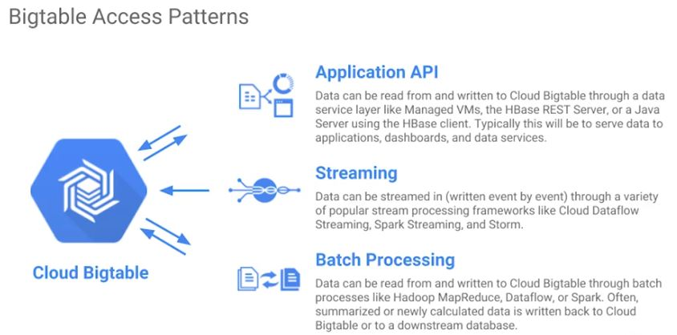

# Cloud Bigtable
~ is Google's NoSql big data database service

----
# What is NoSQL mean? 

Think first of a relational database as offering you tables in which every row has the same set of columns, and the database engine enforces that rule and other rules you specify for each table. That's called the database schema. 

An enforce schema is a big help for some applications and a huge pain for others. 

Some applications call for a much more flexible approach. For example, a NoSQL schema. In other words, for these applications **not all** the rows might need to have the same columns. 

And in fact, the database might be designed to take advantage of that by sparsely populating the rows. That's part of what makes a NoSQL database what it is. 

----
## Cloud Bigtable is managed NoSQL
* Fully managed NoSQL wide-column database service for terabyte applications

> Your databases in Bigtable are sparsely populated tables that can scale to billions of rows and thousands of columns allowing you to store petabytes of data.   

> GCP fully manages the surface, so you don't have to configure and tune it. 

> It's ideal for data that has a single lookup key. 
 - So Some applications developers think of Bigtable as a **persistent hash table**.

Quiz question: Some developers think of Cloud Bigtable as a persistent hashtable. What does that mean?

Answer: Each item in the database can be sparsely populated, and is looked up with a single key. 

## Cloud Bigtable pros:
* ~ is ideal for storing large amounts of data with very low latency. 
* It supports high throughput, both read and write, so it's a great choice for both operational and analytical applications including Internet of Things, user analytics and financial data analysis.

----
## Cloud Bigtable is managed NoSQL
* Accessed using **HBase API**
* Native compatibility with big data, Hadoop ecosystems

**HBase** is the native database for the Apache Hadoop project

----
## Why choose Cloud Bigtable?
* Managed, scalable storage
 - If you manage your own Hbase installation, scaling past a certain rate of queries per second is going to be tough, but with Bigtable you can just increase your machine count which doesn't even require downtime.
 - Also, Cloud Bigtable handles administration tasks like upgrades and restarts transparently.
* Data encryption in-flight and at rest
* Control access with IAM
* Bigtable drives major applications such as Google Analytics and Gmail
 - Bigtable is actually the same database that powers many of Google's core services including search, analytics, maps and Gmail.

----

> All information are in the picture above!