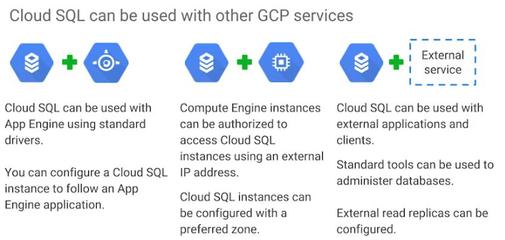

## Cloud SQL is a managed RDBMS
* Offers MySQL and PostgreSQL databases as a service

----
Of course, you could always run your own database server inside a compute engine virtual machine which a lot of GCP customers do. 

But there are some benefits of using the CloudSQL managed service instead:
1. Automatic replication
 - CloudSQL provide several replica services like read, failover, and external replicas - This means that if an outage occurs, CloudSQL can replicate data between multiple zones with automatic failover. 
2. Managed backups
 - CloudSQL also helps you backup your data with either On-Demand or scheduled backups.
3. Vertical scaling (read and write)
 - It can scale vertically by changing the machine type
4. Horizontal scaling (read)
 - It can scale horizontally via read replicas
5. Google security
 - CloudSQL instances include, network firewalls
 - Customer data is encrypted when on Google's internal networks, and when stored in database tables, temporary files, and backups.
6. CloudSQL instances are accessible by other GCP services and even external services.
 - You can authorize compute engine instances for access CloudSQL instances and configure the CloudSQL instance to be in the same zone as your virtual machine
 - CloudSQL also supports other applications and tools that you might be used to like SQL WorkBench, Toad, and other external applications using standard MySQL drivers. 

## Cloud Spanner is a horizontally scalable RDBMS
* Strong global consistency
* Managed instances with high availability
* SQL queries
 - ANSI 2011 with extensions
* Automatic replication
* It can provide pedabytes of capacity

----
## When should we use Cloud Spanner?
* if you have outgrown any relational database
* or sharding your databases for throughput high performance, need transactional consistency, global data and strong consistency
* or just want to consolidate your database. 

> Natural use cases include, financial applications, and inventory applications. 

----
Quiz question: Which database service can scale to higher database sizes?

Answer: Cloud Spanner. - Cloud Spanner can scale to petabyte database sizes, while Cloud SQL is limited by the size of the database instances you choose. At the time the quiz was created, the maximum was 10,230 GB.